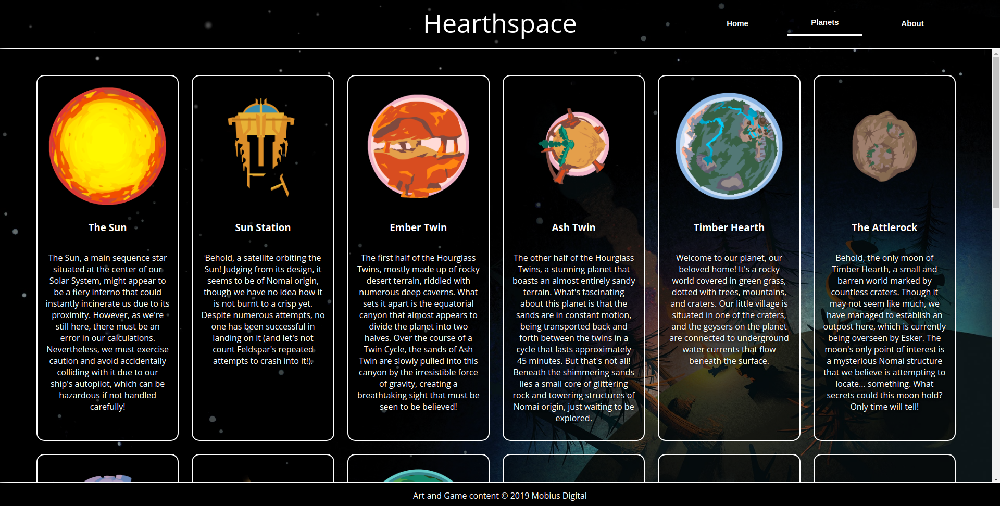

# Explore the Solar System of Outer Wilds!

An example menu web site, written from the standpoint of Outer Wilds' Hearthians, describing their own Solar System.

This website was built as part of the Odin Project curriculum, specifically, the [Restaurant Page Project](https://www.theodinproject.com/lessons/node-path-javascript-restaurant-page), where the goal was to build a dynamic website only through Javascript DOM manipulation and CSS styling. Additionally, [webpack](https://webpack.js.org/) was to be used.

## Live website

[Hearthspace](https://badbadbadbadbad.github.io/menu-page/)

## Copyright

Outer Wilds was developed by [Mobius Digital](https://www.mobiusdigitalgames.com/outer-wilds.html) and published by [Annapurna Interactive](https://annapurnainteractive.com/en). As such, the background image as well as the planet art and concepts belong to them.
